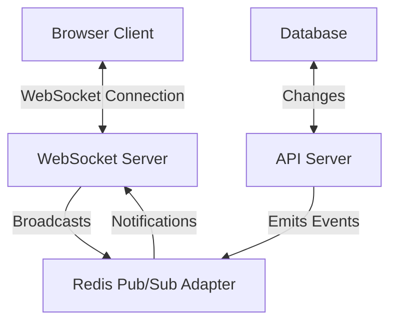
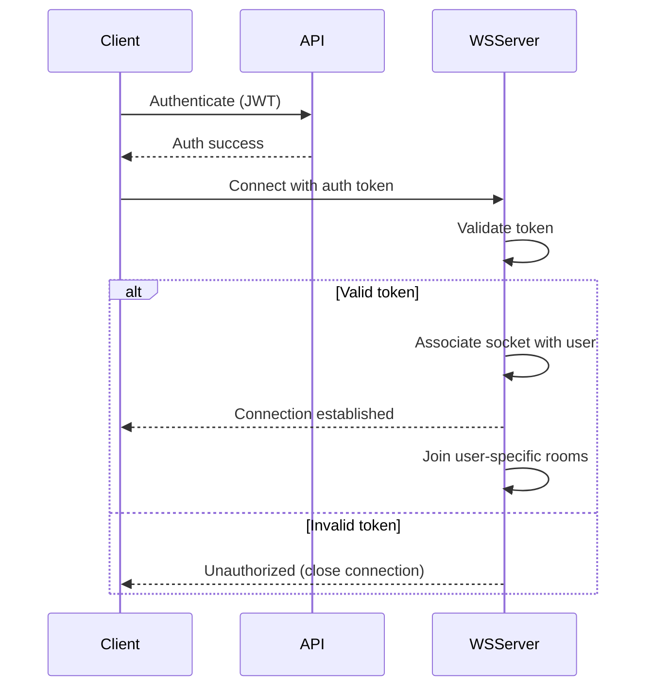

# WebSocket Connections for Real-time Updates

This document outlines the WebSocket implementation for real-time updates in the Time-Booking Application, ensuring users and administrators receive immediate notifications about relevant events without requiring page refreshes.

## WebSocket Architecture

The application uses Socket.IO over standard WebSockets for its reliability features including automatic reconnection and fallback mechanisms.

## Conection Establishment Flow 

## Event Types and Channels 

### Room Structure 

1. User-specific rooms:

user:{userId}: Personal notifications for a specific user
Example: booking confirmations, waitlist updates

2. Lab-specific rooms:

lab:{labId}: Updates about a specific lab
Example: availability changes, maintenance status

3. Admin rooms:

admin:all: All admin notifications
admin:org:{orgId}: Organization-specific admin notifications

4. Super Admin room:

super-admin: System-wide notifications

## Core Events 

| Event Name             | Room(s)                        | Description                       | Payload                                                | Trigger                                            |
| :--------------------- | :----------------------------- | :-------------------------------- | :----------------------------------------------------- | :------------------------------------------------- |
| `booking:created`      | `user:{userId}`, `lab:{labId}`, `admin:all` | New booking created              | `{bookingId, userId, slotId, labId, status}`           | User creates booking                               |
| `booking:updated`      | `user:{userId}`, `admin:all`    | Booking status changed           | `{bookingId, userId, status, updatedBy}`               | User/admin updates booking                         |
| `booking:cancelled`    | `user:{userId}`, `lab:{labId}`, `admin:all` | Booking cancelled                | `{bookingId, userId, slotId, labId}`                  | User/admin cancels booking                         |
| `time-slot:updated`    | `lab:{labId}`                   | Slot availability changed        | `{slotId, labId, status, availableSpots}`              | Booking/cancellation affects capacity              |
| `waitlist:position-changed` | `user:{userId}`                   | User's waitlist position changed | `{waitlistId, userId, slotId, oldPosition, newPosition}` | Higher priority user leaves waitlist               |
| `waitlist:spot-available` | `user:{userId}`                   | Spot became available           | `{waitlistId, userId, slotId, labId}`                 | Booking cancellation creates opening               |
| `notification:new`     | `user:{userId}`                   | New notification for user        | `{notificationId, type, message, read}`                | Any system notification                            |
| `lab:status-changed`   | `lab:{labId}`, `admin:org:{orgId}` | Lab status changed               | `{labId, status, reason}`                             | Admin changes lab status                           |
| `system:announcement`  | `* (all)`                      | System-wide announcement         | `{message, severity, expiresAt}`                       | Super admin broadcasts message                     |
